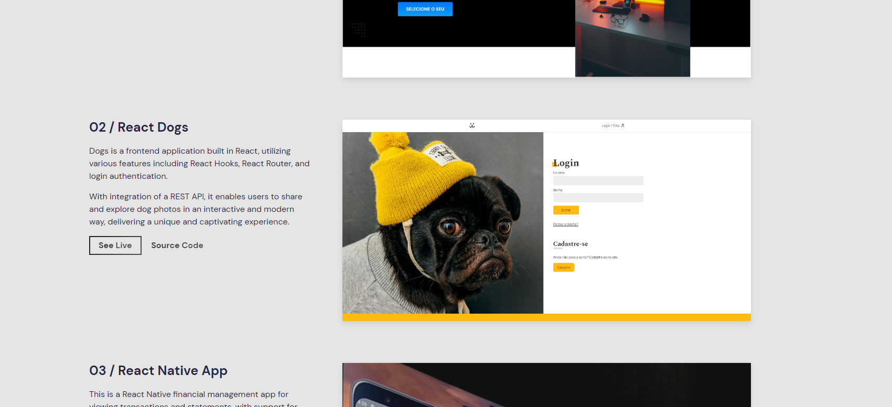

<div align="center" id="top"> 
  

  &#xa0;

  <a href="https://dogs.rodrigolima.tech">Demo</a>
</div>

<h1 align="center">Dogs</h1>


<p align="center">
  

  

  

  

</p>

<!-- Status -->


<hr>

<p align="center">
  <a href="#dart-sobre">Sobre</a> 
  <a href="#sparkles-funcionalidades">Funcionalidades</a>  | 
  <a href="#rocket-tecnologias">Tecnologias</a>  | 
  <a href="#white_check_mark-pré-requesitos">Pré requisitos</a>  | 
  <a href="#checkered_flag-começando">Começando</a>  | 
  <a href="#memo-licença">Licença</a>  | 
  <a href="https://github.com/zrodrigolimaz" target="_blank">Autor</a>
</p>

<br>

## :dart: Sobre ##

Dogs é uma aplicação frontend construída em React, utilizando várias funcionalidades, incluindo React Hooks, React Router e custom hooks

Com a integração de uma API REST, ela permite que os usuários compartilhem e explorem fotos de cachorros de forma interativa e moderna, proporcionando uma experiência única e cativante.

## :sparkles: Funcionalidades ##

✔️ Cadastro do usuário: Crie sua própria conta e comece a interagir.
✔️ Post de fotos: Compartilhe as melhores fotos dos seus pets.
✔️ Comentários em posts de outros usuários: Interaja com outros posts, deixando comentários e feedbacks.
✔️ Estatísticas de visualizações com um dashboard: Acompanhe o engajamento e alcance de seus posts por meio de nossas estatísticas detalhadas.
✔️ Delete de fotos: Você tem total controle sobre suas postagens e pode excluí-las quando quiser.
✔️ Recuperar senha: Caso esqueça sua senha, nós facilitamos a recuperação da mesma.

## :rocket: Tecnologias ##

As seguintes ferramentas foram usadas na construção do projeto:


- [React Js](https://pt-br.reactjs.org/)
- React Router
  Sass 
  Victory


## :white_check_mark: Pré requisitos ##

Antes de começar :checkered_flag:, você precisa ter o [Git](https://git-scm.com) e o [Node](https://nodejs.org/en/) instalados em sua maquina.

## :checkered_flag: Começando ##

```bash
# Clone este repositório
$ git clone

# Entre na pasta
$ cd dogs

# Instale as dependências
$ yarn

# Para iniciar o projeto
$ yarn dev

# O app vai inicializar em <http://localhost:5173/>
```

## :memo: Licença ##

Este projeto está sob licença MIT. Veja o arquivo [LICENSE](LICENSE.md) para mais detalhes.


<a href="#top">Voltar para o topo</a>
